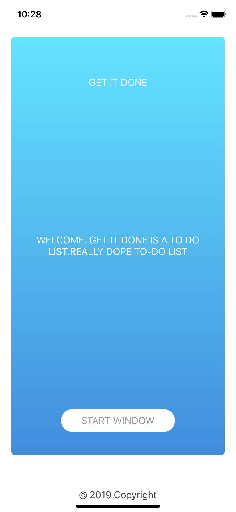
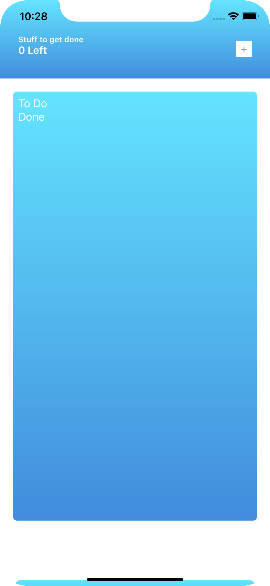
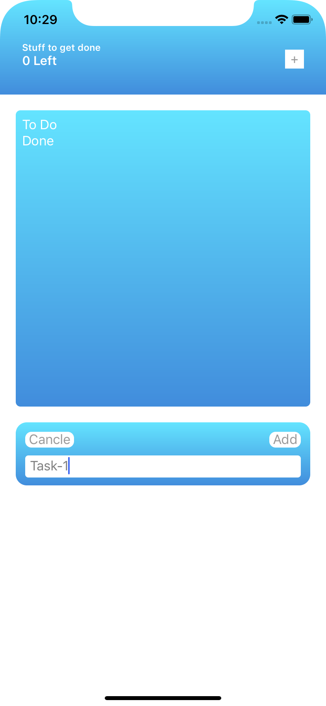
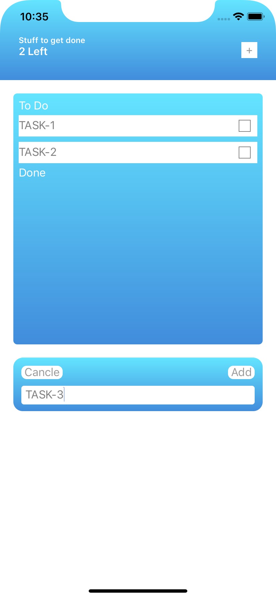
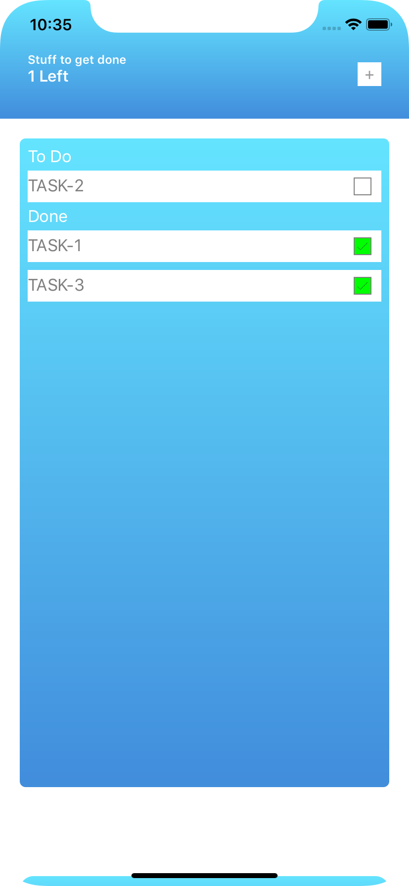

# TODO-APP

### Programmatically UI design
- Splash screen
- Main screen
- Add/Remove task
- Keyboard handle
- coredata/realm database integration (IN PROGRESS)

------------------------------------------------------------------------------------
 
 
 
 

